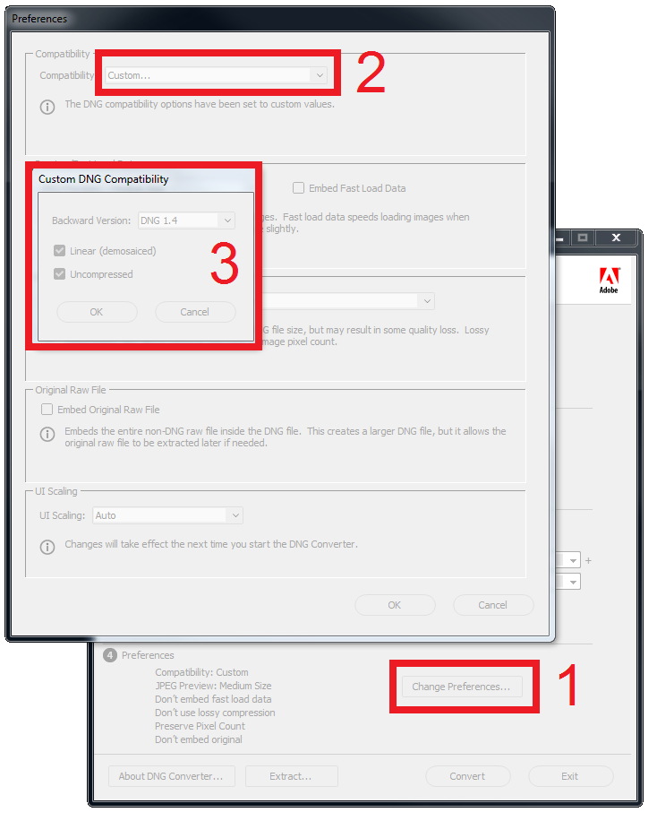

# Underwater Color Restoration

This is a revised implementation the color restoration method described in:

[Diving into Haze-Lines: Color Restoration of Underwater Images. Berman, D. and Treibitz, T. and Avidan S., BMVC2017](https://www.eng.tau.ac.il/~berman/UnderwaterColorRestoration/UnderwaterHazeLines_BMVC2017.pdf)

If you use this code, please cite the appropriate paper.

#### bibtex

>    @inproceedings{UnderwaterHL,    
>      title={Diving into Haze-Lines: Color Restoration of Underwater Images},    
>      author={Berman, D. and Treibitz, T. and Avidan, S.},    
>      booktitle={Proceedings of the British Machine Vision Conference},    
>      publisher = {BMVA Press},
>      year={2017},
>    }

## Getting Started

### System Requirements:
The code requires MATLAB, and was tested on windows.

### Download code and Pre-requisites

#### Option A: with git
Run the following commands to initialize your local repository, and to fetch all of the dependencies:

    git clone https://github.com/danaberman/underwater-hl.git
    cd underwater-hl
    git submodule init
    git submodule update

#### Option B: without git

1. Download the code as a zip file.
2. Download the toolbox from `https://github.com/pdollar/toolbox` into `utils/toolbox/`.
3. Download the toolbox from `https://github.com/pdollar/edges` into `utils/edges/`.

### Demo
1. Change MATLAB's directory to the folder the code was extracted to.
2. Run the file main_underwater_restoration.m in order to see the algorithm's perfomance on the attached images.

#### Working with RAW images
If you wish to use a raw image as input, please download [Adobe DNG Converter](https://helpx.adobe.com/photoshop/digital-negative.html) and convert the raw image to a linear decompressed according to these settings:

 

## Authors
Dana Berman, *danamena@post.tau.ac.il*

## License
 
The software code of the non-local image dehazing algorithm is provided for non-commercial use under the attached [LICENSE.md](LICENSE.md)
